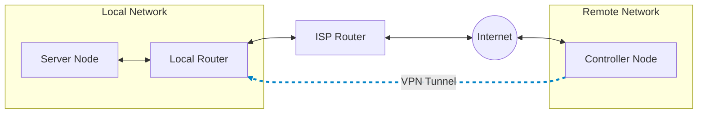

```mermaid
flowchart LR
    subgraph Local [" Local Network "]
        Server["Server Node"]
        LocalRouter["Local Router"]
    end

    ISPRouter["ISP Router"]
    Internet(("Internet"))

    subgraph Remote [" Remote Network "]
        Controller["Controller Node"]
    end

    %% Physical Path
    Server <--> LocalRouter
    LocalRouter <--> ISPRouter
    ISPRouter <--> Internet
    Internet <--> Controller

    %% Overlay VPN Connection
    Controller == "VPN Tunnel" ==> LocalRouter

    %% Style VPN Link
    linkStyle 4 stroke:#0284c7,stroke-width:3px,stroke-dasharray: 5 5;
```