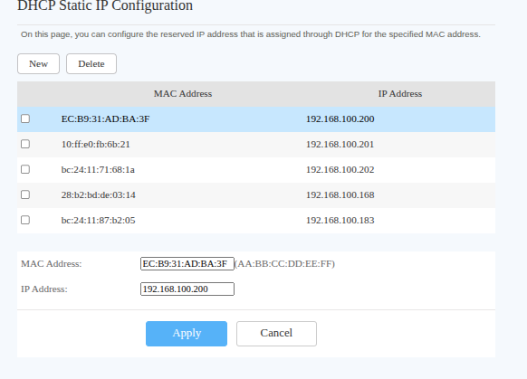

ISP router handles dhcp

Some devices need static ip to have it function. Like the Internal Router, since its hosting services like pi-hole and vault warden. Other examples are EVE-NG vm running inside The Server node. 

More in-dept static ip addressing is in /Architecture/AddressTable.md

