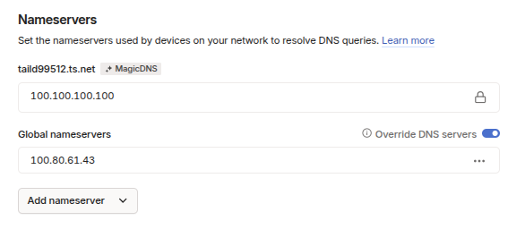

1. in DNS add pihole address in "add nameserver"

2. check override DNS server to have pihole as default DNS for devices connected to tailscale. Since ISP routers don't allow configuring DNS servers  

